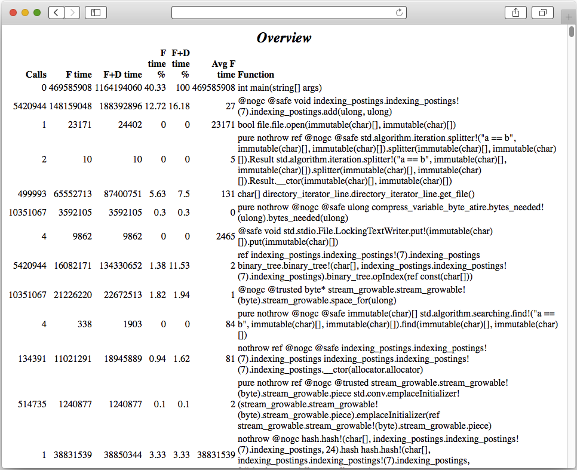
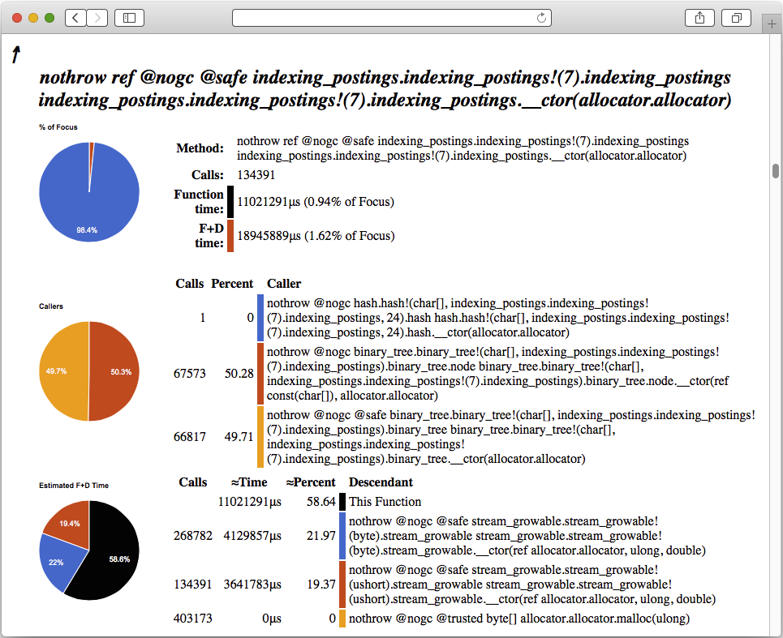
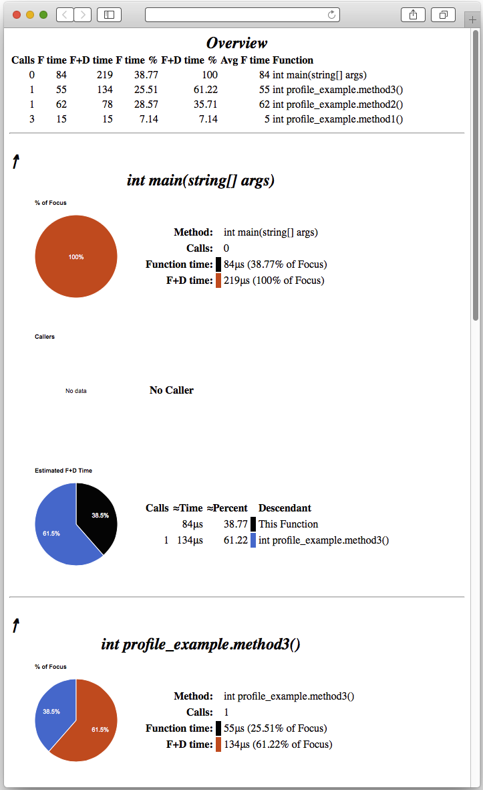

#D Profile Viewer
__by Andrew Trotman__

__Copyright (c) 2015-2016 eBay Software Foundation__

##Table of Contents

* [Purpose](#Purpose)
* [Quick Start Guide](#Quick-Start-Guide)
* [Building D Profile Viewer](#Building-D-Profile-Viewer)
* [Overview Section](#Overview-Section)
* [Method Section](#Method-Section)
* [Example][]

<a name=Purpose>
##Purpose
The D language profiler that comes with DMD produces traces that are not designed for humans to read.
This program reads a trace file (trace.log) and turns it into an interactive HTML file designed for human navigation and understanding.

<a name=Quick>
##Quick Start Guide
Compile your program using `dmd -profile`, then `rm trace.log` then run
your program.  This will produce a fresh file called
`trace.log` in the current directory.  Now run `d_profile_viewer`.  It reads
`trace.log` and generates `trace.html`.  Load that into your web browser.
The columns on each of the tables are sortable by clicking on the table column headings.

Remember, your D program does not create a new `trace.log` for each run, it appends to it.
So delete `trace.log` between runs.

<a name=Building>
##Building D Profile Viewer
`dmd d_profile_viewer.d demangle.d`

<a name=Overview>
##Overview Section
At the top of the `html` file is an overview of each of the methods that was called.
It will look something like the image below, where:

* __Calls__ gives the number of times the method was called.
* __F time__ gives the amount of time (microseconds) spend in that method.
* __F+D time__ gives the amount of time (microseconds) spend in that method and all descendants of that method.
* __F time %__ gives the percent of total execution time spent in that method.
* __F+D time %__ gives the percent of total execution time spent in that method and all descendants of that method.
* __Avg F time__ gives the average time in the function (excluding descendants).
* __Function__ gives the name of the demangled name of the function.

__F time__ is the time spend in the method *excluding* all method calls done by that method whereas the __F+D time__
*includes* the time spent doing all those method calls.

__NOTE:__The table can be sorted on any field in either increasing or decreasing order by clicking on the column header.

<a name=Method>
##Method Section
Following the Overview Section is a section for each method. That is, in turn, divided into four sections.
The top section provides a link to the Overview section (i.e. the top of the file) marked "&uarr;", along with the demangled name of the method.

Next is a section giving basic statistics about *this method* including:

* __Method__ The method name.
* __Calls__ The number of times the method was called.
* __Function time__ The amount of time (in microseconds, μs) spend in the method *excluding* descendants.
* __F+D time__ The amount of time (in microseconds, μs) spend in the method *including* descendants.

To the left of these stats is a pie chars showing the proportion of the total execution time spent in this function and the descendants of this function.

Next comes details about the *callers* of this function.

* __Calls__ The number of times this method was called by that method.
* __Percent__ The percent of the total called to this method that are accounted to that method.
* __Caller__ The method that called this method.

This table is sortable on any column by clicking on the column header.  By clicking on a __Caller__ the browser will navigate to the details about that function.  A graph showing the percentage of calls is given on the left.

The final section is details about *method called* by this method including:

* __Calls__ The number of times this method calls that method.
* __&asymp;Time__ The approximate time spent in that method (see below).
* __&asymp;Percent__ The approximate proportion of time spent in that method (see below).
* __Descendant__ The name of the descendant method called by this method.

This table is sortable on any column by clicking on the column header.  By clicking on a __Descendant__ the browser will navigate to the details about that function.

__&asymp;Time__ and __&asymp;Percent__ are not generated by `dmd -profile`, they are approximated by D Profile Viewer.  This is achieved by taking the total time spent in that method an its descendants, dividing by the total number of times that method is called, then multiplying by the number of times this method calls that method.  In other words, assuming all calls to that function take the same amount of time, its the proportion attributed to calls by this method.  Although this is a reasonable way to compute a value, it can be wildly inaccurate in the case where some calls are quick while others are slow.
Note, this also explains why the sum of this section does not equal the F+D time for this method.

The graph on the left shows the percent of time spend in each of the descendants and this function.

To avoid confusion, this method is identified as __This Function__.

<a name=Example>
##Example
Starting with a simple program that does a few method calls:

	module profile_example;

	int method1()
	{
	return 1;
	}

	int method2()
	{
	return method1 + method1;
	}

	int method3()
	{
	return method2 + method1;
	}

	int main(string[] args)
	{
	return method3;
	}

Compile using DMD and the profile option

`dmd -profile profile_example.d `

Now run the program

`./profile_example`

This will produce a file called `trace.log` in the directory the program was run from.
That file should look something like this

	------------------
			 2	_D15profile_example7method2FZi
			 1	_D15profile_example7method3FZi
	_D15profile_example7method1FZi	3	56	56
	------------------
			 1	_D15profile_example7method3FZi
	_D15profile_example7method2FZi	1	280	224
			 2	_D15profile_example7method1FZi
	------------------
			 1	_Dmain
	_D15profile_example7method3FZi	1	480	200
			 1	_D15profile_example7method2FZi
			 1	_D15profile_example7method1FZi
	------------------
	_Dmain	0	784	304
			 1	_D15profile_example7method3FZi

	======== Timer Is 3579545 Ticks/Sec, Times are in Microsecs ========

	  Num          Tree        Func        Per
	  Calls        Time        Time        Call

			1         219          84          84     _Dmain
			1          78          62          62     int profile_example.method2()
			1         134          55          55     int profile_example.method3()
			3          15          15           5     int profile_example.method1()

The top part of this file is the program's call graph.  Names are shown mangled.  The bottom
part is a bunch of stats about each method (whose names are demangled).

Now run the D profile viewer

`d_profile_viewer`

This will read `trace.log` from the current directory and generate a `trace.html` in the current directory.  Once loaded into a web browser it will display something like the image below.
At the top is an overview of all the methods that were called, the number of times the method was called, and so on.  Below that there is a section for each method showing stats about that method, about the callers of that method, and the methods it calls.

__*Last Updated:18 March 2016*__

